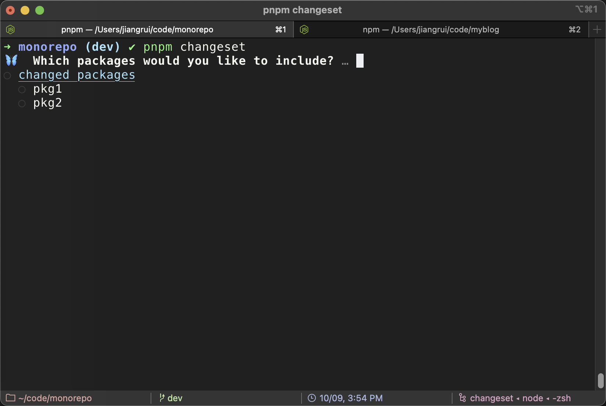
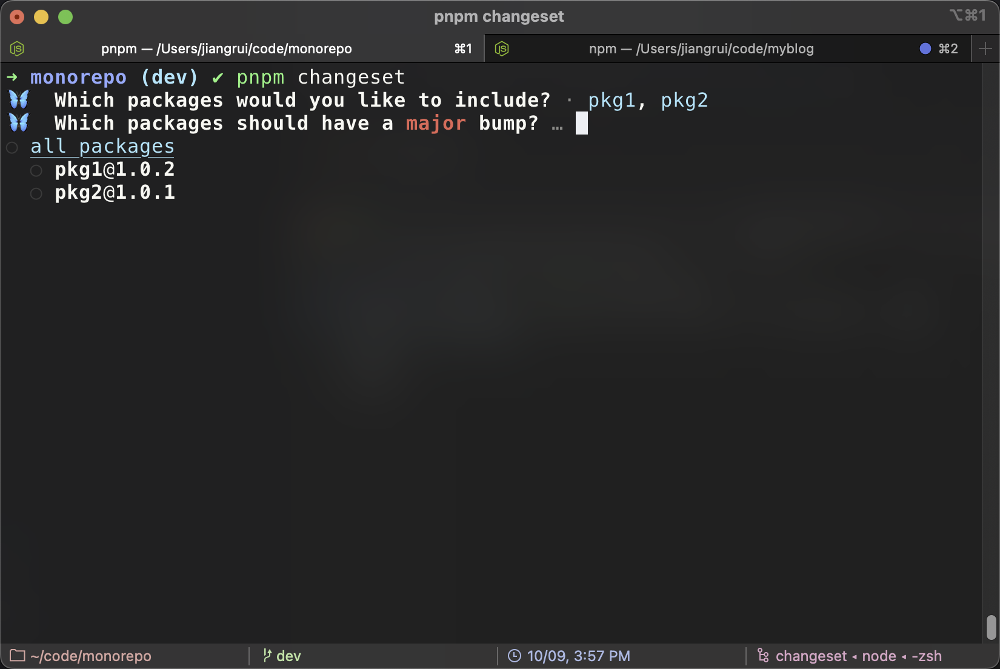
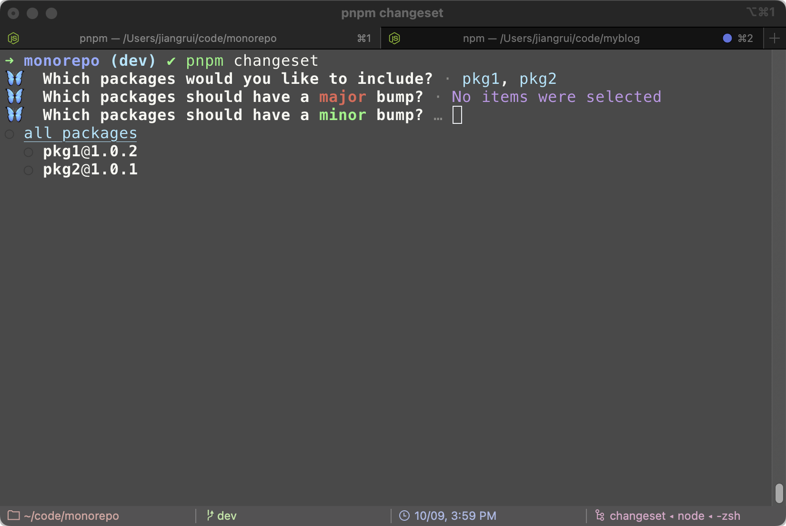
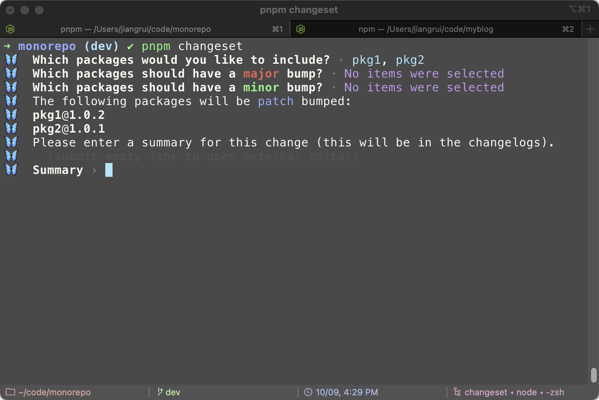
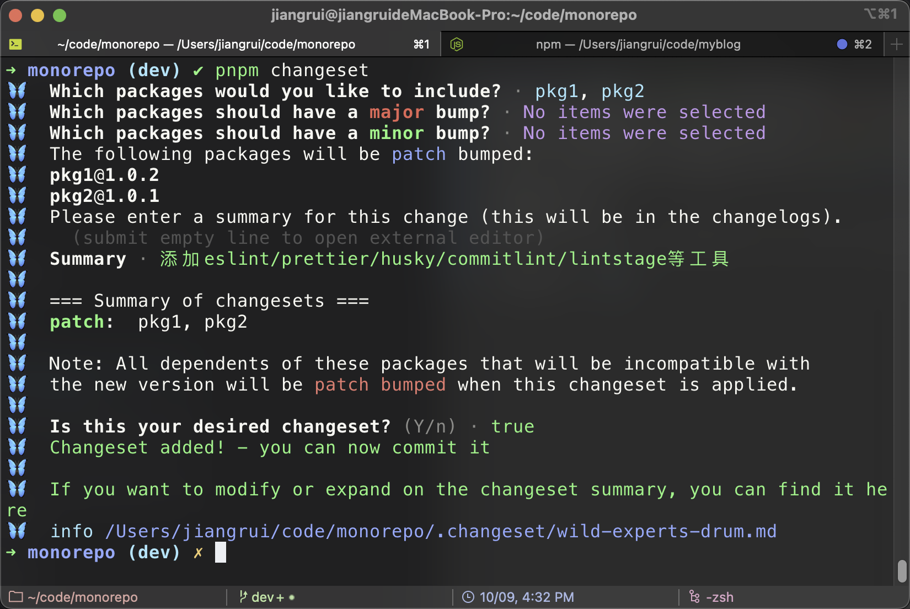
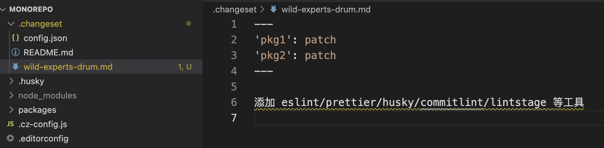
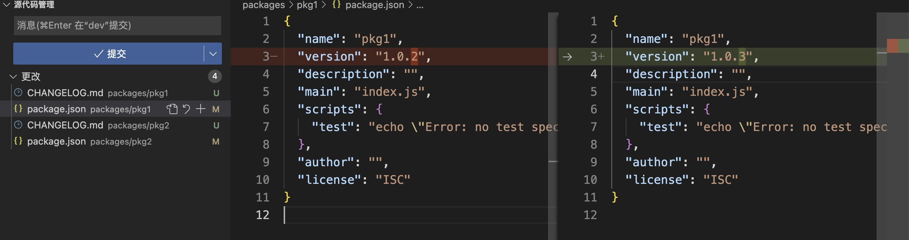

## 什么是 monorepo？

什么是`monorepo`？以及和 `multirepo` 的区别是什么?

简而言之，`monorepo` 就是把多个工程放到一个 `git` 仓库中进行管理，因此他们可以共享同一套构建流程、代码规范也可以做到统一，特别是如果存在模块间的相互引用的情况，查看代码、修改 bug、调试等会更加方便。

## 什么是 pnpm 的 [workspace](https://pnpm.io/zh/workspaces)

> pnpm 内置了对单一存储库（也称为多包存储库、多项目存储库或单体存储库）的支持， 你可以创建一个 `workspace` 以将多个项目合并到一个仓库中。
>
> 一个 `workspace` 的根目录下必须有 `pnpm-workspace.yaml` 文件， 也可能会有 `.npmrc` 文件。

## 什么是 [Changesets](https://github.com/changesets/changesets)

什么是 [changesets](https://github.com/changesets/changesets) ? 根据官网的介绍 changesets 是用于管理版本及变更日志的工具，专注多包管理。

`Changesets` 具有以下几个特点：

- 在开发时，需要开发者提供本次变更涉及的包名称、升级版本类型(`pathch、minor、major`)及变更信息，即 changeset。

- 在发布版本时，会根据 `changeset` 自动升级对应包的版本号，并在对应的包中生成 `Changelog` 信息。

- 在 `Monorepo` 场景中，`changeset` 会自动生成仓库依赖图，升级时只会升级变更包及相关依赖包的版本号。

## 为什么要使用 Changesets

> `workspace` 中的包版本管理是一个复杂的任务，`pnpm` 目前也并未提供内置的解决方案。 不过，有两个不错且支持 pnpm 的版本控制工具可以使用：
>
> - [changesets](https://github.com/changesets/changesets)
> - [Rush](https://rushjs.io/)

## 使用 pnpm 搭建 monorepo 工程

### 安装 pnpm

```sh
npm install -g pnpm
```

:::tip
v7 版本的 pnpm 安装使用需要 node 版本至少大于 v14.19.0，所以在安装之前首先需要检查下 node 版本。
:::

### 工程初始化

```sh
# 创建项目目录并进入
mkdir monorepo && cd monorepo
# 创建子包目录
mkdir packages
# 初始化项目
pnpm init
```

:::warning
根目录 `pacakge.json` `private` 防止被发出去
:::

### 配置 pnpm 的 workspace

```sh
#根目录创建配置文件 pnpm-workspace.yaml
touch pnpm-workspace.yaml
```

pnpm-workspace.yaml 内容

```yaml
packages:
  - "packages/*"
```

配置项目只允许使用 pnpm

```json
// package.json配置scripts命令钩子
"scripts": {
    "preinstall": "npx only-allow pnpm"
}
```

> preinstall 脚本会在 install 之前执行，现在，只要有人运行 npm install 或 yarn install，就会调用 only-allow 去限制只允许使用 pnpm 安装依赖。

### 配置安装 changesets （init）

将 changesets 作为开发依赖项安装在工作空间的根目录中：

```sh
pnpm add @changesets/cli -D -w
# -w是将依赖安装在最外层根项目
```

然后使用 changesets 的初始化命令：

```sh
pnpm changeset init
```

当使用初始化命令后 会生成.changeset 文件夹，包含配置文件

```json
// .changeset/config.json文件
{
  "$schema": "https://unpkg.com/@changesets/config@2.1.1/schema.json",
  "changelog": "@changesets/cli/changelog",
  "commit": false,
  "fixed": [],
  "linked": [],
  "access": "restricted",
  "baseBranch": "main",
  "updateInternalDependencies": "patch",
  "ignore": []
}
```

### 使用添加新的 changesets (add)

要生成新的 changesets，请在仓库的根目录中执行`pnpm changeset`。 `.changeset` 目录中生成的 `markdown` 文件需要被提交到到仓库。

```sh
pnpm changeset
#或者
pnpm changeset add
```

使用以上命令后，会将此次更新内容与变动暂存在`.changeset`文件中，等下下次发布变更时进行消耗，可存在多个变更的暂存

### 使用 changeset 发布变更 （version）

1. 运行 `pnpm changeset version`。 这将提高先前使用 `pnpm changeset` （以及它们的任何依赖项）的版本，并更新变更日志文件。
2. 运行 `pnpm install`。 这将更新锁文件并重新构建包。
3. 提交更改。
4. 运行 `pnpm publish -r`。 此命令将发布所有包含被更新版本且尚未出现在包注册源中的包。

### 项目工程化相关

#### typescript 支持

```sh
pnpm add -Dw typescript
```

#### eslint 与 prettier 支持

安装相关依赖

```sh
pnpm add eslint prettier eslint-plugin-prettier eslint-config-prettier -Dw
pnpm add @typescript-eslint/eslint-plugin @typescript-eslint/parser  -Dw
```

**配置 eslint**

`.eslint.js`文件配置

```js
module.exports = {
  env: {
    node: true,
    es2021: true,
    browser: true, //浏览器
  },
  parser: "@typescript-eslint/parser",
  plugins: ["prettier", "@typescript-eslint"],
  parserOptions: {
    ecmaVersion: "latest",
    parser: "@typescript-eslint/parser",
    sourceType: "module",
  },
  extends: [
    "eslint:recommended", // 内置规则
    "plugin:@typescript-eslint/recommended",
  ],
  rules: {
    "linebreak-style": ["off", "windows"],
    "no-mixed-spaces-and-tabs": ["off", "windows"],
    "no-consol": "off",
    "no-var": "error", // 不能使用var声明变量
    "no-extra-semi": "error",
    "@typescript-eslint/indent": ["error", 2],
    "import/extensions": "off",
    indent: ["error", 2, { SwitchCase: 1 }], // error类型，缩进2个空格
    "space-before-function-paren": 0, // 在函数左括号的前面是否有空格
    "eol-last": 0, // 不检测新文件末尾是否有空行
    semi: ["error", "never"], // 在语句后面加分号
    "no-console": ["error", { allow: ["log", "warn"] }], // 允许使用console.log()
    "arrow-parens": 0,
    "no-new": 0, //允许使用 new 关键字
    "comma-dangle": [2, "never"], // 数组和对象键值对最后一个逗号， never参数：不能带末尾的逗号, always参数：必须带末尾的逗号，always-multiline多行模式必须带逗号，单行模式不能带逗号
    "no-undef": 0,
  },
};
```

`.eslintignore`文件配置

```
node_mudules/
dist/
lib/
dist
pnpm-lock.yaml
packages/*/dist
packages/*/node_mudules
```

**配置 prettier**

`.prettierignore`文件配置

```
/node_modules/**
.local
/dist/*
/test/**
/build/*
**/*.svg
lib/
es/
dist/
_site/
coverage/
CNAME
LICENSE
yarn.lock
netlify.toml
yarn-error.log
*.sh
*.snap
.gitignore
.npmignore
.prettierignore
.DS_Store
.editorconfig
.eslintignore
**/*.yml
components/style/color/*.less
**/assets
.gitattributes
.stylelintrc
.vcmrc
.png
.npmrc.template
.huskyrc
.gitmodules
*.png
v2-doc/
```

`.prettierrc.js`文件配置

```js
module.exports = {
  useTabs: false,
  tabWidth: 2,
  printWidth: 80,
  singleQuote: true,
  trailingComma: "none",
  semi: false,
  endOfLine: "auto",
};
```

### 安装 husky 与 commitlint

具体操作可看[下一篇](/pages/209fb8/)

## Changesets 的使用

初始化上面已经说过了 这里主要介绍项目的变更与发布

### changset 的添加

当项目的某个子项目或者多个发生变更 执行`pnpm changeset`命令

```sh
pnpm changeset
```



操作界面会列出**改动**与**未改动**的所有子包（子项目） 需要进行选择这次添加内容

当选择文件结束 会询问是否是`major`版本的改动



当未做选择 会询问是否是`minor`版本的改动



当未做选择 会自动默认是`patch`版本的改动



这个时候我们需要填写此次的更改内容描述，这个会用于后续的 changelog 的文件生成



当设置添加完毕会发现`.changeset`文件夹新增了一个`md`文件 这个文件就是暂存的更改记录



到这个 changset 的添加就算完成了

### changeset 的发布

1. 运行 `pnpm changeset version`。 这将提高先前使用 `pnpm changeset` （以及它们的任何依赖项）的版本，并更新变更日志文件。

```sh
pnpm changeset version
```

当执行此文件 会发现相应的子项目会进行`package.json`文件中的版本更新与生成`changelog.md`文件



这个时候我们也会发现上面说的生成的随机命名文件`sild-experts-drum.md`文件消失了（被消耗）

2. 运行 `pnpm install`

   这一步主要是将更新锁文件并重新构建包

3. 提交更改。执行`git add . && pnpm run commit`

4. 运行 `pnpm publish -r`。 此命令将发布所有包含被更新版本且尚未出现在包注册源中的包。
