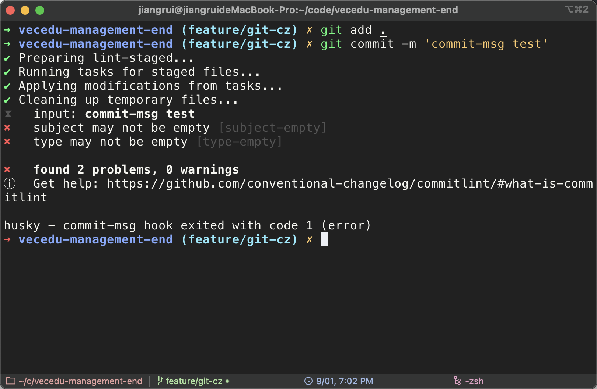
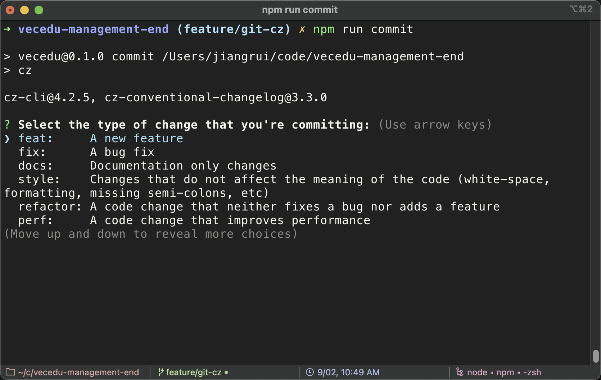
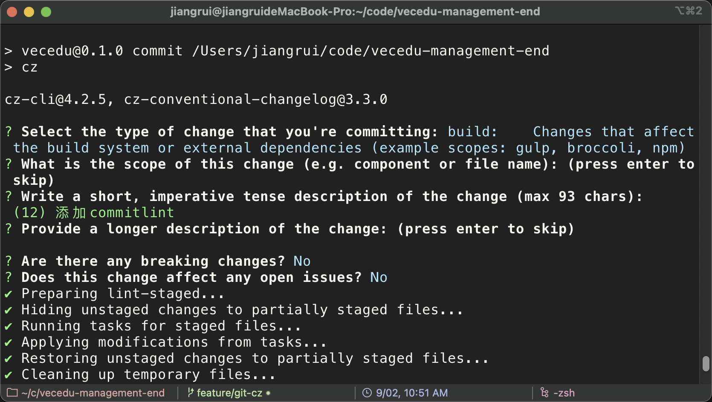
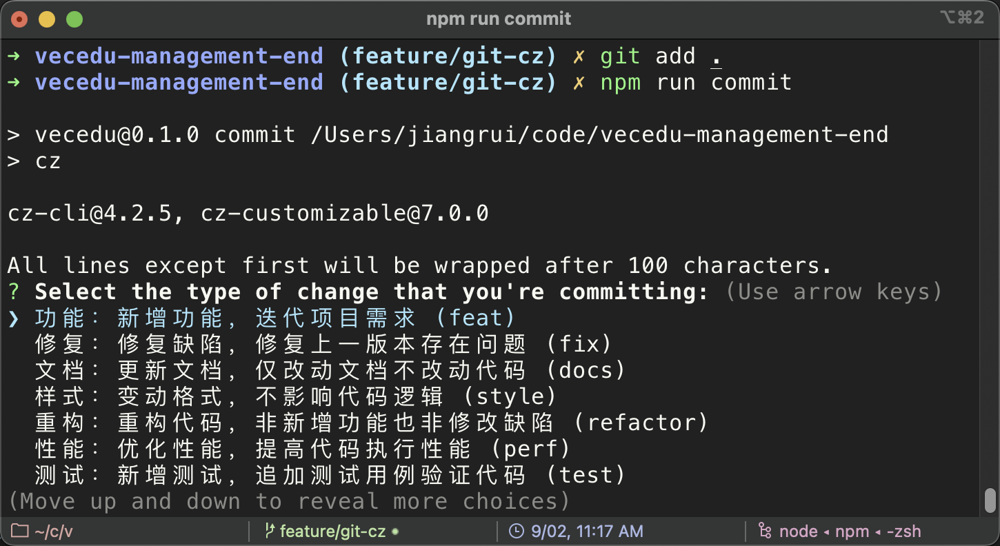

## 背景

在团队多人开发中，规范的 commit message 可以快速定位代码提交历史，回溯问题根源，方便组内多人协作，提高团队效率。

## husky 安装与使用

### 1. 项目中安装

```sh
npm i lint-staged -D  # 安装lint-staged
npm i husky -D  # 安装husky
# 或者
pnpm add lint-staged husky -D
```

### 2. 创建.husky/目录并指定该目录为 git hooks 所在的目录

在 pacakge.json 中添加`prepare`脚本

- 使用命令的方式添加

  ```sh
  npm set-script prepar "husky install"
  ```

  :::tip
  命名方式添加需要`npm`版本在 7.x+
  :::

- 手动在 package.json 中添加

```json
{
  "scripts": {
    "prepare": "husky install"
  }
}
```

> prepare 脚本会在执行 npm install 之后自动执行。也就是说当我们执行 npm install 安装完项目依赖后会执行 husky install 命令。

添加好脚本命令后 初始化 husky

```sh
npm run prepare # 初始化husky,将 git hooks 钩子交由,husky执行
```

### 3.添加 git hooks

创建一条`pre-commit hook`

```sh
npx husky add .husky/pre-commit "npx lint-staged"
```

执行命令后 `.husky/`目录下新增一个名为`pre-commit`的 shell 脚本
在知道后执行`git commit`命令的时候就会执行这条脚本

生成的 shell 脚本如下(**自动生成**)

```sh
#!/usr/bin/env sh
. "$(dirname -- "$0")/_/husky.sh"

npx lint-staged

```

执行当前脚本后，会执行当前命令`npx lint-staged`
所以需要配置`lint-staged`的配置文件

:::tip
可通过根目录添加.lintstagedrc.json 文件

可通过在 package.json 中添加
:::

```sh
touch .lintstagedrc.json # 根目录添加lint-staged的配置文件
```

```json
// .lintstagedrc.json示例
{
  "*.{js,jsx,ts,tsx}": ["prettier --write .", "eslint  --fix"],
  "*.md": ["prettier --write"]
}
```

上述示例中的配置就是进行 js、ts 等文件格式的代码`prettier`格式化与`eslint`

## commitlint 安装与使用

### 1. 在项目中安装

安装`commitlint`用于`commit`操作的规范检测
安装`@commitlint/config-conventional`用于`commitlint`的一个检测标准

```sh
npm i @commitlint/cli @commitlint/config-conventional -D
# 或者
pnpm add @commitlint/cli @commitlint/config-conventional -D
```

### 2.添加 commitlint 配置

根目录创建`commitlint.config.js`配置文件 并写入规则 使用`@commitlint/config-conventional`规则

> `@commitlint/config-conventional` 这是一个规范配置,标识采用什么规范来执行消息校验, 这个默认是 Angular 的提交规范

```sh
echo "module.exports = {extends: ['@commitlint/config-conventional']}" > commitlint.config.js
```

### 3.husyk 中添加 commit-msg

```sh
npx husky add .husky/commit-msg 'npx --no-install commitlint --edit "$1"'
```

执行命令后 `.husky/`目录下新增一个名为`commit-msg`的 shell 脚本

```json
// commit-msg脚本内容
#!/usr/bin/env sh
. "$(dirname -- "$0")/_/husky.sh"

npx --no-install commitlint --edit "$1"
```

当执行`git commit`命令提交`commit-msg`就会触发 `git hook` 并执行上述脚本

上述脚本执行就会就行 commitlint 的校验（校验规则就是`@commitlint/config-conventional`）

::: tip 测试
添加以上`git hook`后我们可以来进行一个测试 随意提交一个`commit-msg`

填写的`commit-msg`为`'commit-msg test'`没能通过规则 无法进行`git`提交
:::



### 4. 安装辅助提交依赖（commitizen）

当有了 commitlint 检查提交规范 如果手动提交就比较麻烦 这里就可以借助工具`commitizen`

[commitizen 官方](http://commitizen.github.io/cz-cli/)

> Simple commit conventions for internet citizens.

```sh
npm i commitizen cz-conventional-changelog -D  # 安装commitizen依赖
# 或者
pnpm add commitizen cz-conventional-changelog -D
```

安装好相关依赖后 需要在`package.json`进行配置

```json
{
    "script": {
        "commit": "cz"  // 添加提交指令 使用cz提交
    }
    "config": {
        "commitizen": {
            "path": "cz-conventional-changelog" // 使用这个依赖提供的预设
        }
    }
}
```

::: tip 测试
当依赖安装好并且进行了以上配置 就可以运行`npm run commit`进行测试
:::

使用`cz`进行提交 会出现选项供我们选择



当此次提交类型选定后 就需要填写本次提交的短描述与长描述等相关信息



### 5. 添加 commitizen 的自定义提示信息

安装`cz-customizable`,安装这个依赖后就可以自定义提示内容 可以自定义中文或者加上一些 emoji

```sh
npm i cz-customizable -D
# 或者
pnpm add cz-customizable -D
```

当`cz-customizable`安装好之后 就需要在`packgae.json`中的`commitizen`配置

```json
{
  "config": {
    "commitizen": {
      "path": "node_modules/cz-customizable" // 将提示信息依赖修改成cz-customizable
    }
  }
}
```

经过上面的配置 就可以自定义提示信息了

这就需要新增一个自定义内容文件

```sh
touch .cz-config.js
```

`.cz-config.js`文件就是用来自定义提示信息

```js
// .cz-config.js 示例
module.exports = {
  allowBreakingChanges: ["feat", "fix"],
  allowCustomScopes: true,
  scopes: [],
  types: [
    {
      name: "功能：新增功能，迭代项目需求 (feat)",
      value: "feat",
    },
    {
      name: "修复：修复缺陷，修复上一版本存在问题 (fix)",
      value: "fix",
    },
    {
      name: "文档：更新文档，仅改动文档不改动代码 (docs)",
      value: "docs",
    },
    {
      name: "样式：变动格式，不影响代码逻辑 (style)",
      value: "style",
    },
    {
      name: "重构：重构代码，非新增功能也非修改缺陷 (refactor)",
      value: "refactor",
    },
    {
      name: "性能：优化性能，提高代码执行性能 (perf)",
      value: "perf",
    },
    {
      name: "测试：新增测试，追加测试用例验证代码 (test)",
      value: "test",
    },
    {
      name: "构建：更新构建，改动构建工具或外部依赖 (build)",
      value: "build",
    },
    {
      name: "脚本：更新脚本，改动CI或执行脚本配置 (ci)",
      value: "ci",
    },
    {
      name: "事务：变动事务，改动其他不影响代码的事务 (chore)",
      value: "chore",
    },
    {
      name: "回滚：回滚版本，撤销某次代码提交 (revert)",
      value: "revert",
    },
    {
      name: "合并：合并分支，合并分支代码到其他分支 (merge)",
      value: "merge",
    },
    {
      name: "同步：同步分支，同步分支代码到其他分支 (sync)",
      value: "sync",
    },
    {
      name: "改进：改进功能，升级当前功能模块 (impr)",
      value: "impr",
    },
  ],
};
```

::: tip 测试
自定义提示配置好了 我们可以尝试`npm run commit`提交一下

就可以看到我们自定义的提示内容设置成功了
:::



## **总结**

其实到这里应该可以结束了 但是可能会遇到一些常见问题

### 常见问题

1. 自定义的提示信息 提交为什么无法通过 `commitlint` 校验？

由于我们自定义了提示信息和规则 这时候可能就没办法通过`@commitlint/config-conventional`的校验

这个时候我们就需要安装`commitlint-config-cz` 让`commitlint`使用`cz`的规范

```sh
npm i commitlint-config-cz -D
# 或者
pnpm add commitlint-config-cz -D
```

当安装好依赖后 需要修改`.commitlintrc.js`文件夹

```json
module.exports = {
  "extends": ["cz"],
  "rules": {}, // 这里可以配置规则 类似于eslint的配置
};

```
