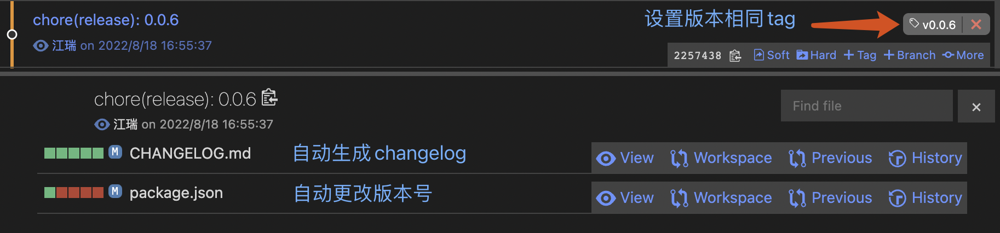
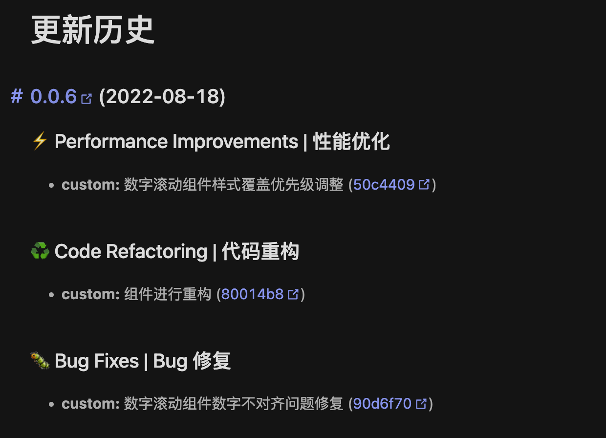

## standard-version 安装与使用

[上一篇](/pages/209fb8/)我们已经介绍了如何进行 `commit-msg` 的规范提交与校验

那我们 git 提交之后怎么进行版本的控制与自动生成 `changelog` 呢？那就需要使用到`standard-version`

### 介绍

> standard-version 是一款遵循语义化版本（semver）和 commit message 标准规范的版本自动化工具，它还可以使生成 changelog 自动化。并且将我们符合 Conventional Commits 规范的提交信息格式化。

### 作用

- 自动升级版本
- 自动打 tag
- 自动生成 changelog

### 安装

::: tip 使用前提
在使用 standard-version 之前，需要遵循 Conventional Commit Specifications 来进行标准化的 commit message 编写。这是因为 standard-version 是基于 commit 类型来更新版本号的（feature 会更新 minor, bug fix 会更新 patch, BREAKING CHANGES 会更新 major）。commitizen 可以帮助我们提交符合 Conventional Commit Specifications 的 commit message。
:::

上一篇：[commitLint 与 commit-msg 操作](/pages/209fb8/)

**安装**

```sh
npm i standard-version -D
```

**配置脚本**

在`package.json`文件中添加脚本

::: tip
高版本可以使用`npm set-script`进行设置
:::

```json
// package.json
{
  "scripts": {
    "release": "standard-version"
  }
}
```

### 配置

安装好相应依赖与指令需要进行配置

增加 `.versionrc` 文件来格式化 log ，使我们的 `changelog` 根据 Conventional Commits 规范更加语义化。

```json
{
  "header": "", // 可自定义添加生成的changelog头部内容
  "types": [
    { "type": "feat", "section": "✨ Features | 新功能" },
    { "type": "fix", "section": "🐛 Bug Fixes | Bug 修复" },
    { "type": "init", "section": "🎉 Init | 初始化" },
    { "type": "docs", "section": "✏️ Documentation | 文档" },
    { "type": "style", "section": "💄 Styles | 风格" },
    { "type": "refactor", "section": "♻️ Code Refactoring | 代码重构" },
    { "type": "perf", "section": "⚡ Performance Improvements | 性能优化" },
    { "type": "test", "section": "✅ Tests | 测试" },
    { "type": "revert", "section": "⏪ Revert | 回退" },
    { "type": "build", "section": "📦 Build System | 打包构建" },
    { "type": "update", "section": "🚀 update | 构建/工程依赖/工具升级" },
    { "type": "tool", "section": "🚀 tool | 工具升级" },
    { "type": "ci", "section": "👷 Continuous Integration | CI 配置" }
  ],
  // 跳过相关内容
  "skip": {
    "bump": false, // 是否跳过更改版本
    "changelog": false, // 是否跳过生产changelog
    "commit": false, // 是否跳过自动commit
    "tag": false // 是否跳过打tag
  }
}
```

### 使用

当一切都配置好，使用 commitlint 进行代码提交之后

将代码合并到发版分支 可执行`npm run release`

**按默认规则升级版本号**

```sh
npm run release # 执行版本更新
```

这个时候就会自动更改`pacakge.json`中的`version`

`npm`的版本号格式：`major.minor.patch`

自动更新的版本号会按照默认规则升级`patch`

**手动设置版本更新**

1. 直接升级 `major`
   ```json
   "scripts": {
   "release-major": "standard-version --release-as major",
   }
   ```
2. 直接升级`minor`
   ```json
   "scripts": {
   "release-major": "standard-version --release-as minor",
   }
   ```
3. 直接升级`patch`
   ```json
   "scripts": {
   "release-major": "standard-version --release-as patch",
   }
   ```
4. 强制打一个静态版本号
   ```json
   "scripts": {
   "release-static": "standard-version --release-as 3.3.3",
   }
   ```
5. 发布第一个版本

```sh
npm run release -- --first-release
# 或者
npx standard-version --first-release
```

### 示例

git 提交记录



生成的`CHANGELOG`文件

